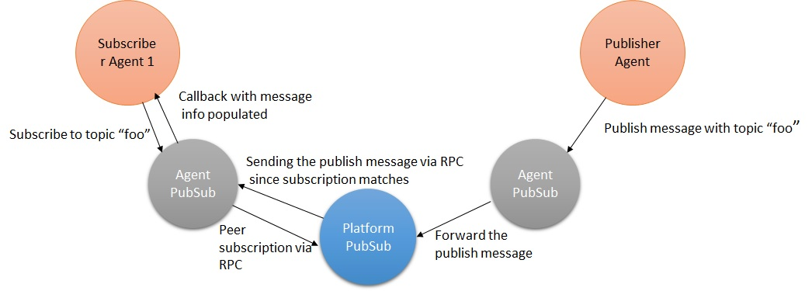

=======================================
PubSub Subsystem Specification
=======================================

Description
===========
PubSub subsystem is responsible for implementing the publish/subscribe mechanism for sending and receiving messages between agents. An agent interested in publishing any message of specific topic can do so using the publish method provided by the subsystem. Similarly, all subscribers interested in receiving messages of specific topic can do so using subscribe method provided by this subsystem. In addition, the agent can also unsubscribe from receiving messages of specific topic type, list all the subscriptions etc. The pubsub subsystem will internally use RPC mechanism to provide the publish/subscribe functionality.
This PubSub functionality is provided by two sub components, agent pubsub and platform pubsub.

**Agent Pubsub** - The agent pubsub gets be instantiated when an agent is started. It is associated with each agent. When an agent subscribes to any prefix, the agent pubsub performs the following activities.

1. Store the subscription info i.e. peer, bus, prefix and callback method in its local data structure.
2. Forward the subscription info to the platform pubsub via RPC.
3. Receive the published messages from platform pubsub.
4. Check if the peer, bus and prefix fields in the published message matches any of the stored subscriptions.
5. If yes, retrieve the corresponding callback method and pass the received message via the callback method to the subscribed agent.

When an agent publishes a message of some topic, the agent pubsub forwards the header, message, topic, peer and bus information to the platform pubsub via RPC. The platform pubsub is responsible for routing the message to all the subscribers (if any).

**Platform PubSub** - The platform pubsub agent gets be started when the VOLTTRON platform is started. It is responsible for the following activities.

1. Store the subscription info sent by agent pubsub into its local data structure i.e. peer, bus and prefix.
2. When platform pubsub receives a published message from any of the agent pubsubs, it should check in its local data structure for list of subscribers subscribed to the same topic, peer and bus. It should then forward the message, topic, peer, bus information to all subscribed agent pubsubs via RPC.
The diagram below shows the behavior of pubsub subsystem with single publisher agent and subscriber agent.

Software Interfaces
===================

**Subscribe** - This allows an agent to subscribe to topics beginning with prefix and register a corresponding callback method. Agent pubsub should store the subscription info such as peer, prefix, callback, bus in its local data structure and forward the same to platform pubsub to also store the same for later use.

**Publish** - This allows an agent to publish headers and messages of given topic to all the subscribers on the same bus. Agent pubsub forwards the header, message, and topic information to platform pubsub.  Platform pubsub retrieves list of all subscribers subscribed to same topic, and distributes the message to each subscriber agent pubsub. The agent pubsub at the subscriber agent should should get the message via the callback method.

**List** - This should provide a list of topic subscriptions for a given combination of peer, prefix and bus.

**Unsubscribe** - This allows an agent to unsubscribe from receiving any messages with topics beginning with a specified prefix. Agent pubsub removes the (peer, prefix, callback, bus) combination from its local data structure and informs the platform pubsub to do the same.

**Add Peer** - Agent pubsub and platform pubsub should add the peer or sync all subscriptions of the peer.

**Remove Peer** - Agent pubsub and platform pubsub should remove all subscriptions related to the peer.

User Interfaces
===============

The pubsub subsystem provides capability to protect topics. It can limit who can publish to a given topic. The user has to configure the following details in ``$VOLTTRON_HOME/auth.json`` to provide write-protection to a topic.

1. Add the topic to be protected
2. Set the corresponding capabilities property
3. List the agents that are allowed to publish to that topic

Functional Capabilities
=======================

1. PubSub subsystem should allow agents to subscribe to receive messages of specific filter type, peer and bus
2. The filter type can be
    1. Exact topic or subtopic string
    2. Prefix to a topic
    3. All topics ("")
3. The topics should follow the format: topic/subtopic/subtopic.
4. Subscriber agents should provide callbacks to the PubSub subsystem to forward the published messages matching the subscribed topics.
5. PubSub subsystem should allow agents to publish messages of specific filter type.
6. If an agent publishes to a topic, then any agent interested in that topic should receive the data irrespective of the agents running in same VOLTTRON platform or different VOLTTRON platforms.
7. PubSub subsystem should allow agents to unsubscribe from receiving messages of specific topics/prefixes.
8. PubSub subsystem should provide methods to list all the active subscriptions.
9. PubSub subsystem should synchronize periodically with peers to remove stale/forgotten subscriptions.
10. Performance of PubSub subsystem should scale well with increase of publisher and subscriber agents.
11. PubSub subsystem should provide capability to write-protect topics i.e., to protect subscribers from receiving messages (on protected topic) from unauthorized agents.

Data Structure
==============

1. Agent pubsub needs a data structure (my subscriptions) to hold  all the subscriptions made by its agent. It consists of a set of callbacks for each combination of peer, bus and prefix.
2. Platform pubsub needs a data structure (peer subscriptions) to hold set of all the peers/subscribers for each combination of bus and prefix. On any publish event, this data structure will be used to retrieve all subscribers/peers subscribed to a given bus and prefix combination.

Security/ Privacy
==================

The PubSub subsystem should provide capability to protect subscribers from receiving messages (on the protected topic) from unauthorized agents. The protected topics need to be configured in ``$VOLTTRON_HOME/auth.json``. When an agent publishes a message of particular topic, the PubSub subsystem should check if it is a protected topic and the publisher agent has permission to publish the protected topic. If no, it should disallow the agent to publish the message.

Constraints and Limitations
===========================

1. Pubsub subsystem uses RPC mechanism to forward the messages to all the subscriber agents. In the future, the RPC mechanism has to be replaced with native zmq publish/subscribe mechanism with authentication and authorization features
2. If publisher and subscriber agents are running in different VOLTTRON platforms, then communication between the agents do not occur transparently.
    1. A forwarder agent is required to forward the messages published in one platform to other platform where the subscriber is running. Else,
    2. The subscriber agent needs to connect to the VOLTTRON platform of the publisher agent to receive the published messages.
3. PubSub subsystem provides protection on only write-protect topics. To protect message confidentiality, we need a read-protection mechanism for pub/sub.
